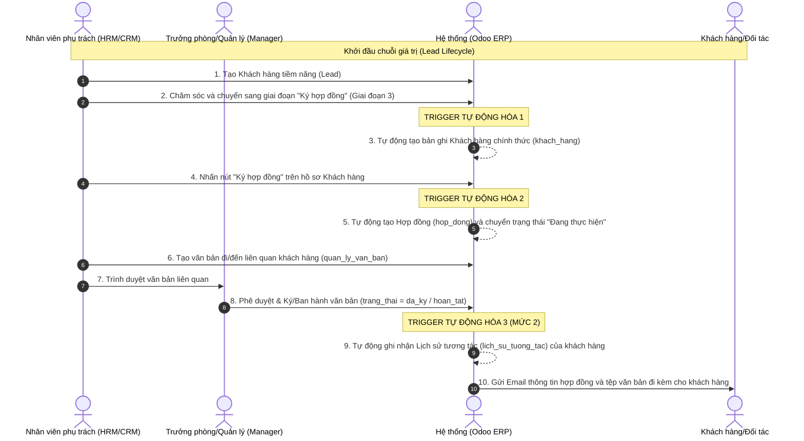

# Sơ đồ Luồng nghiệp vụ kết hợp (End-to-End Business Flow)
## Đề tài: Tích hợp Quản lý Khách hàng (CRM) & Quản lý Văn bản

### 1. Sơ đồ Mermaid (Tự động render trên GitHub)

### 2. Mô tả các điểm tích hợp chính

* **Actor/Vai trò tham gia**:
  * **Nhân viên (CRM/HRM)**: Người nhập dữ liệu lead, chăm sóc, yêu cầu ký hợp đồng, phụ trách xử lý văn bản.
  * **Trưởng phòng (Manager)**: Người duyệt văn bản, ký ban hành văn bản.
  * **Hệ thống (Odoo ERP)**: Thực hiện các trigger tự động liên kết các luồng dữ liệu.
  * **Khách hàng**: Người nhận kết quả (Email hợp đồng/văn bản).

* **Tích hợp HRM (Dữ liệu gốc)**:
  * Tất cả các đối tượng (Lead, Khách hàng, Báo giá, Hợp đồng, Văn bản) đều bắt buộc liên kết với model `nhan_vien` (được quản lý tập trung ở module `nhan_su`) thông qua quan hệ `Many2one`. 
  * Chức vụ và Phòng ban của nhân sự đại diện trên Hợp đồng được lấy tự động trực tiếp từ hồ sơ **Lịch sử công tác** của nhân viên đó trong module Nhân sự, tránh nhập liệu trùng lặp.

* **Trigger Tự động hóa (Mức 2)**:
  * **Trigger 1**: Tự động chuyển đổi Lead -> Khách hàng chính thức.
  * **Trigger 2**: Tự động sinh Hợp đồng kèm ngày hiệu lực khi nhấn nút "Ký hợp đồng" trên Khách hàng.
  * **Trigger 3**: Tự động ghi nhận tệp văn bản/quyết định vào **Lịch sử tương tác** của Khách hàng khi văn bản liên quan được Trưởng phòng phê duyệt.
