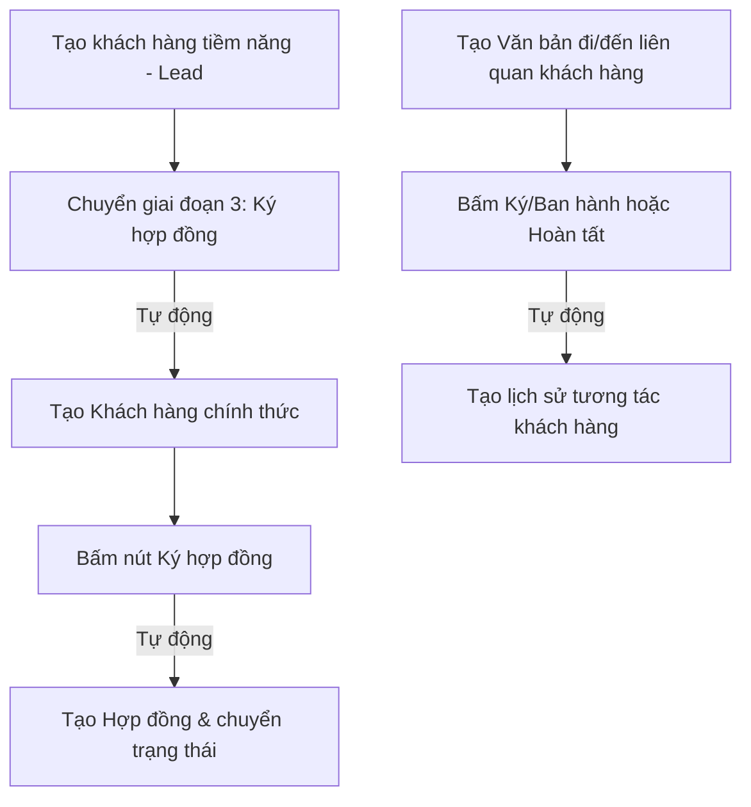

# HƯỚNG DẪN THAO TÁC CHI TIẾT HỆ THỐNG
## MODULE QUẢN LÝ KHÁCH HÀNG & QUẢN LÝ VĂN BẢN (ODOO 16)

Tài liệu này hướng dẫn chi tiết quy trình thao tác và vận hành nghiệp vụ liên kết tích hợp giữa các module: **Nhân sự (HRM)**, **Khách hàng (CRM)**, và **Quản lý Văn bản** trên hệ thống Odoo.

---

## 1. QUY TRÌNH MỨC 1: TÍCH HỢP HỆ THỐNG & NHẤT QUÁN DỮ LIỆU
Hệ thống sử dụng dữ liệu từ module **Nhân sự** (`nhan_su`) làm dữ liệu gốc. Khi thao tác các nghiệp vụ Khách hàng hoặc Văn bản, dữ liệu nhân viên phụ trách sẽ được kế thừa tự động nhằm tránh nhập liệu trùng lặp.

### Thao tác chọn nhân viên phụ trách:
* Khi tạo mới **Khách hàng tiềm năng**, **Khách hàng chính thức**, **Báo giá**, **Hợp đồng** hoặc **Văn bản**:
  * Tại trường **Nhân viên phụ trách/Người thực hiện**, click chọn danh sách nhân viên.
  * Danh sách này được lấy trực tiếp từ hồ sơ nhân viên trong module **Quản lý nhân sự**.
  * Riêng trong hồ sơ **Hợp đồng**, hệ thống sẽ tự động hiển thị chi tiết chức vụ và phòng ban của nhân viên đó ở cột **Bên B (Nhân viên)** để đảm bảo tính minh bạch.

---

## 2. QUY TRÌNH MỨC 2: TỰ ĐỘNG HÓA QUY TRÌNH NGHIỆP VỤ (EVENT-DRIVEN)
Quy trình nghiệp vụ khép kín từ tiếp cận khách hàng tiềm năng cho đến khi ký hợp đồng và ban hành văn bản pháp lý.



### 2.1. Quy trình Chuyển đổi Khách hàng tiềm năng (Lead -> Customer)
* **Bước 1**: Truy cập **Quản lý Khách hàng** > **Khách hàng tiềm năng (Lead)**.
* **Bước 2**: Nhấn **Tạo** để thêm một cơ hội mới (Lead) với thông tin liên hệ và nhân viên phụ trách.
* **Bước 3**: Tiến hành chăm sóc qua các giai đoạn (Tiếp cận > Kết nối > Đàm phán).
* **Bước 4**: Khi khách hàng đồng ý ký kết, bạn nhấn vào giai đoạn **Ký hợp đồng** (hoặc nhấn nút **Xác nhận hợp đồng**).
* **Sự kiện Tự động hóa**: 
  * Hệ thống sẽ tự động tạo một bản ghi Khách hàng mới bên bảng **Danh sách khách hàng** chính thức.
  * Toàn bộ thông tin: Tên, Số điện thoại, Email, Nhân sự phụ trách sẽ tự động đồng bộ sang hồ sơ mới.

---

### 2.2. Quy trình Ký Hợp đồng & Quản lý Hợp đồng giao dịch
* **Bước 1**: Truy cập **Quản lý Khách hàng** > **Danh sách khách hàng**.
* **Bước 2**: Tìm và mở hồ sơ khách hàng vừa được chuyển đổi từ Lead (đang ở giai đoạn Ký hợp đồng).
* **Bước 3**: Nhấn nút **Ký hợp đồng** (màu xanh, góc trên bên trái).
* **Sự kiện Tự động hóa**:
  * Giai đoạn của khách hàng sẽ được cập nhật thành **Ký hợp đồng**.
  * Hệ thống tự động tạo mới một bản ghi **Hợp đồng** bên bảng Hợp đồng với tiêu đề `"Hợp đồng kinh tế: [Tên khách hàng]"` và giá trị lấy từ doanh thu dự kiến của khách hàng.
  * Tự động đặt ngày bắt đầu là ngày hôm nay và ngày kết thúc sau đó 1 năm.
* **Bước 4**: Bạn có thể vào menu **Giao dịch > Hợp đồng** để đính kèm tệp scan PDF hợp đồng và nhấn **Gửi Email** để tự động gửi thông báo điều khoản cho khách hàng.

---

### 2.3. Quy trình Số hóa Văn bản & Tự động ghi nhận Lịch sử tương tác
Khi phát sinh văn bản liên quan đến khách hàng (ví dụ: Biên bản bàn giao, Quyết định phê duyệt dự án, Công văn gửi đối tác):
* **Bước 1**: Truy cập **Quản lý Văn bản** > **Sổ văn bản** (Chọn Văn bản đến hoặc Văn bản đi).
* **Bước 2**: Nhấn **Tạo** mới, điền thông tin trích yếu nội dung văn bản, chọn **Nhân viên phụ trách** và chọn **Khách hàng/Đối tác liên quan**.
* **Bước 3**: Thực hiện quy trình phê duyệt văn bản:
  * *Đối với văn bản đi*: Nhấn **Trình duyệt** > Nhấn **Ký/Ban hành**.
  * *Đối với văn bản đến*: Nhấn **Bắt đầu xử lý** > Nhấn **Hoàn tất xử lý**.
* **Sự kiện Tự động hóa**:
  * Khi trạng thái chuyển sang **Đã ký/Ban hành** hoặc **Hoàn tất**, hệ thống sẽ **tự động tạo một bản ghi mới trong mục Lịch sử tương tác** của Khách hàng liên quan.
  * Nội dung tương tác sẽ được ghi nhận tự động: *"Ký và Ban hành văn bản đi: [Tên văn bản] (Số hiệu: [Số hiệu])"* giúp nhân viên CSKH theo dõi lịch sử trao đổi tài liệu mà không cần nhập thủ công.

---

## 3. CÁC TIỆN ICS GIAO DIỆN (UI/UX) NÂNG CAO
Hệ thống được thiết kế thêm các Widget đồ họa để người quản lý dễ dàng nắm bắt thông tin:
* **Form Khách hàng**: 
  * Phía trên cùng có bảng **Tổng quan (KPI Dashboard)** hiển thị tổng giá trị hợp đồng đã ký và số lần tương tác dưới dạng thẻ màu sắc sang trọng.
  * Có các nút **Smart Buttons (Hợp đồng, Văn bản)** ở góc phải giúp click nhanh để xem các dữ liệu liên quan.
* **Form Văn bản**:
  * Có **Banner thông tin văn bản** tự động tô màu theo luồng (Xanh dương cho Văn bản đến, Cam cho Văn bản đi) giúp nhận diện nhanh loại tài liệu.

---

## 4. HƯỚNG DẪN CẬP NHẬT HỆ THỐNG KHI THAY ĐỔI FILE CODE
Nếu bạn chỉnh sửa file Python hoặc XML trong code, hãy thực hiện nâng cấp theo các bước sau để tránh lỗi hiển thị:
1. **Khởi động lại server**: Nhấn `Ctrl + C` tại Terminal đang chạy Odoo, sau đó chạy lại lệnh:
   ```bash
   ./odoo-bin -c odoo.conf
   ```
2. **Nâng cấp từ giao diện Web**:
   * Truy cập Odoo trên trình duyệt.
   * Vào menu **Apps**, nhấn **Update Apps List** trên thanh công cụ.
   * Tìm module `khach_hang` và nhấn **Upgrade (Nâng cấp)**.
   * Tìm module `quan_ly_van_ban` và nhấn **Upgrade (Nâng cấp)**.
   * Nhấn `Ctrl + F5` trên trình duyệt để xóa sạch cache giao diện cũ.
